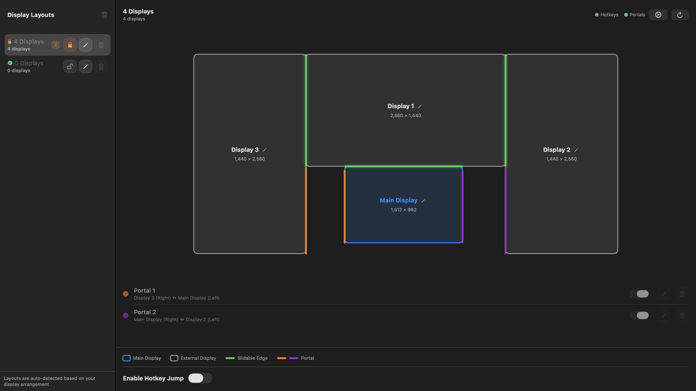

# MousePortal

<p align="center">
  <strong>Mouse Cursor Management for Multi-Display macOS</strong>
</p>

<p align="center">
  <a href="https://github.com/ai-eks/MousePortal/releases">
    
  </a>
  <a href="LICENSE">
    
  </a>
  <a href="#">
    
  </a>
</p>

> **[中文版本](README.zh.md)** | [English](README.md)

MousePortal is a macOS utility for managing mouse cursor movement between multiple displays. It provides two main features:

1. **Hotkey Jump** - Global keyboard shortcuts to instantly teleport the cursor to specific displays
2. **Portals** - Custom edge-to-edge teleportation zones that warp the cursor when crossing defined screen boundaries

<p align="center">
  
</p>

## Features

### Hotkey Jump
- Configure custom global shortcuts for each display
- Support for any key + modifier combinations
- Support for mapping via display layout name or ID

### Portal System
- Define custom teleportation zones on display edges
- Support for bidirectional portals (from one display edge to another)
- Two trigger modes:
  - **Automatic** - Always active
  - **Key-held** - Requires holding a modifier key (default: Option)
- Visual editor for easy creation and adjustment of portal zones

### Multi-language Support
Available in 20 languages: English, Simplified Chinese, Traditional Chinese, Japanese, Korean, German, French, Spanish, Portuguese (Brazil), Russian, Italian, Dutch, Polish, Turkish, Arabic, Hindi, Thai, Vietnamese, Indonesian, Malay.

### Other Features
- Launch at login
- Menu bar quick access
- Configuration profile management (for different setups)
- Display layout visualization

## System Requirements

- macOS 13.0 or later
- **Accessibility Permission** required (System Settings > Privacy & Security > Accessibility)

## Installation

### Download from Releases

1. Download the latest `.zip` file from [Releases](https://github.com/ai-eks/MousePortal/releases)
2. Extract and drag `MousePortal.app` to `/Applications` folder
3. On first launch, grant Accessibility permission in System Settings

### Build from Source

```bash
# Clone the repository
git clone https://github.com/ai-eks/MousePortal.git
cd MousePortal

# Build
swift build -c release

# Run
swift run
```

## Usage Guide

### First-Time Setup

1. Launch MousePortal
2. Open **System Settings > Privacy & Security > Accessibility**
3. Add MousePortal and ensure the toggle is enabled
4. Return to MousePortal main window

### Configure Hotkeys

1. Open MousePortal main window
2. Select **Hotkeys** in the left sidebar
3. Click the hotkey input field and press your desired shortcut
4. Select the display layout for this hotkey
5. Click **Save**

### Create Portals

1. Select **Portal Editor** in the left sidebar
2. Click **+ New Portal**
3. Select source and target displays
4. Choose an edge (top/bottom/left/right)
5. Adjust the portal zone start and end positions
6. Select trigger mode (automatic or key-held)
7. Name and save your portal

### Display Layouts

1. Define your display arrangement in **Display Layouts**
2. Assign a name to each layout (e.g., "Dual Display", "Triple Display")
3. Specify relative positions of each display

## Architecture

### Core Services

| Service | Description |
|---------|-------------|
| `PortalService` | Monitors mouse movement, detects when cursor crosses portal lines, warps cursor using `CGWarpMouseCursorPosition` |
| `HotkeyService` | Listens for global keyboard shortcuts via CGEvent |
| `PermissionService` | Handles macOS Accessibility permission |
| `DisplayService` | Fetches display info via `CGGetActiveDisplayList`/`CGDisplayBounds` |
| `LanguageService` | Handles dynamic language switching |
| `LaunchAtLoginService` | Manages launch at login |

### Key Models

- **`PortalPair`** - Two `PortalLine` objects defining a bidirectional warp zone
- **`HotkeyConfig`** - Maps a key+modifiers combo to a display layout
- **`ConfigProfile`** - Named configuration snapshots for different setups

## Development

### Requirements

- macOS 13+
- Swift 5.9+
- Xcode 15+

### Development Commands

```bash
# Open in Xcode
open Package.swift

# Run tests
swift test

# Build release version
swift build -c release
```

### Project Structure

```
MousePortal/
├── MousePortal/              # Main application
│   ├── Models/               # Data models
│   ├── Views/                # SwiftUI views
│   ├── Services/             # Core services
│   ├── Utils/                # Utilities
│   ├── Protocols/            # Protocol definitions
│   └── Resources/            # Resources and localization
├── MousePortalTests/         # Unit tests
│   ├── Models/
│   ├── Services/
│   ├── Utils/
│   └── Mocks/
└── docs/                     # Documentation
```

## Contributing

MousePortal is a focused utility and is mainly maintained by the project owner.

Bug reports and small focused fixes are welcome. Larger feature ideas may be discussed in issues first.

## Privacy

See [PRIVACY.md](PRIVACY.md) for the privacy note.

## License

This project is licensed under the Apache 2.0 License - see the [LICENSE](LICENSE) file for details.

## FAQ

### Q: Why is Accessibility permission required?
A: MousePortal needs to listen for global keyboard events and monitor mouse position, which requires macOS Accessibility permission.

### Q: Portals not working?
A: Please ensure:
1. Accessibility permission is granted
2. The portal is enabled
3. If using key-held mode, make sure you're holding the modifier key
