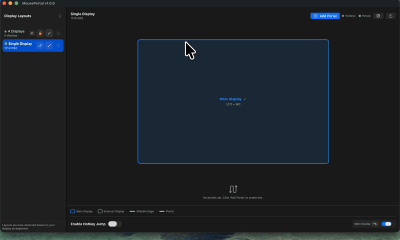

# MousePortal

<p align="center">
  <strong>macOS 多显示器鼠标光标管理工具</strong>
</p>

<p align="center">
  <a href="https://github.com/ai-eks/MousePortal/releases">
    
  </a>
  <a href="LICENSE">
    
  </a>
  <a href="#">
    
  </a>
</p>

> **[English Version](README.md)** | 中文

MousePortal 是一个 macOS 实用工具，用于在多个显示器之间管理鼠标光标移动。它提供两种主要功能：

1. **热键跳转** - 全局键盘快捷键，瞬间将光标移动到指定显示器中心
2. **传送门** - 自定义的边缘到边缘传送区域，当光标跨越定义的屏幕边界时自动传送

<p align="center">
  
</p>

## 功能特性

### 热键跳转
- 为每个显示器配置自定义全局快捷键
- 支持任意键 + 修饰键组合
- 支持通过显示器布局名称或 ID 进行映射

### 传送门系统
- 在显示器边缘定义自定义传送区域
- 支持双向传送（从一个显示器的边缘到另一个显示器的边缘）
- 支持两种触发模式：
  - **自动模式** - 始终激活
  - **按键模式** - 需要按住修饰键（默认为 Option）
- 可视化编辑器，可轻松创建和调整传送门区域

### 多语言支持
支持 20 种语言：英语、简体中文、繁体中文、日语、韩语、德语、法语、西班牙语、葡萄牙语（巴西）、俄语、意大利语、荷兰语、波兰语、土耳其语、阿拉伯语、印地语、泰语、越南语、印尼语、马来语。

### 其他功能
- 开机自动启动
- 菜单栏快捷访问
- 配置文件管理（支持不同场景的配置）
- 显示器布局可视化

## 系统要求

- macOS 13.0 或更高版本
- 需要授予 **辅助功能权限**（系统设置 > 隐私与安全性 > 辅助功能）

## 安装

### 从发布页面下载

1. 从 [Releases](https://github.com/ai-eks/MousePortal/releases) 下载最新版本的 `.zip` 文件
2. 解压并将 `MousePortal.app` 拖拽到 `/Applications` 文件夹
3. 首次运行时，在系统设置中授予辅助功能权限

### 从源码构建

```bash
# 克隆仓库
git clone https://github.com/ai-eks/MousePortal.git
cd MousePortal

# 构建
swift build -c release

# 运行
swift run
```

## 使用指南

### 首次设置

1. 启动 MousePortal
2. 打开 **系统设置 > 隐私与安全性 > 辅助功能**
3. 添加 MousePortal 并确保开关已打开
4. 返回 MousePortal 主界面

### 配置热键

1. 打开 MousePortal 主界面
2. 在左侧边栏选择 **热键设置**
3. 点击热键输入框并按下你想要的快捷键
4. 选择该热键对应的显示器布局
5. 点击 **保存**

### 创建传送门

1. 在左侧边栏选择 **传送门编辑**
2. 点击 **+ 新建传送门**
3. 选择源显示器和目标显示器
4. 选择边缘（上/下/左/右）
5. 调整传送门区域的起始和结束位置
6. 选择触发模式（自动或按键）
7. 命名并保存你的传送门

### 显示器布局

1. 在 **显示器布局** 中定义你的显示器排列
2. 为每个布局指定一个名称（例如 "双显示器", "三显示器"）
3. 指定每个显示器的相对位置

## 架构

### 核心服务

| 服务 | 描述 |
|------|------|
| `PortalService` | 监控鼠标移动，检测光标何时跨越传送门线，使用 `CGWarpMouseCursorPosition` 传送光标 |
| `HotkeyService` | 通过 CGEvent 监听全局键盘快捷键 |
| `PermissionService` | 处理 macOS 辅助功能权限 |
| `DisplayService` | 通过 `CGGetActiveDisplayList`/`CGDisplayBounds` 获取显示器信息 |
| `LanguageService` | 处理动态语言切换 |
| `LaunchAtLoginService` | 管理开机自启动 |

### 关键模型

- **`PortalPair`** - 定义双向传送区域的两个 `PortalLine` 对象
- **`HotkeyConfig`** - 将键 + 修饰键组合映射到显示器布局
- **`ConfigProfile`** - 用于不同设置的命名配置快照

## 开发

### 要求

- macOS 13+
- Swift 5.9+
- Xcode 15+

### 开发命令

```bash
# 打开 Xcode
open Package.swift

# 运行测试
swift test

# 构建 release 版本
swift build -c release
```

### 项目结构

```
MousePortal/
├── MousePortal/              # 主应用
│   ├── Models/               # 数据模型
│   ├── Views/                # SwiftUI 视图
│   ├── Services/             # 核心服务
│   ├── Utils/                # 工具类
│   ├── Protocols/            # 协议定义
│   └── Resources/            # 资源和本地化
├── MousePortalTests/         # 单元测试
│   ├── Models/
│   ├── Services/
│   ├── Utils/
│   └── Mocks/
└── docs/                     # 文档
```

## 贡献

MousePortal 是一个功能比较集中的小工具，主要由项目作者维护。

欢迎提交 bug 反馈和范围清晰的小修复。较大的功能想法可以先通过 issue 讨论。

## 隐私

隐私说明见 [PRIVACY.md](PRIVACY.md)。

## 许可证

本项目采用 Apache 2.0 许可证 - 详见 [LICENSE](LICENSE) 文件

## 常见问题

### Q: 为什么需要辅助功能权限？
A: MousePortal 需要监听全局键盘事件和监控鼠标位置，这些操作需要 macOS 的辅助功能权限。

### Q: 传送门不工作怎么办？
A: 请确保：
1. 辅助功能权限已授予
2. 传送门已启用
3. 如果使用按键模式，确保按住了修饰键
